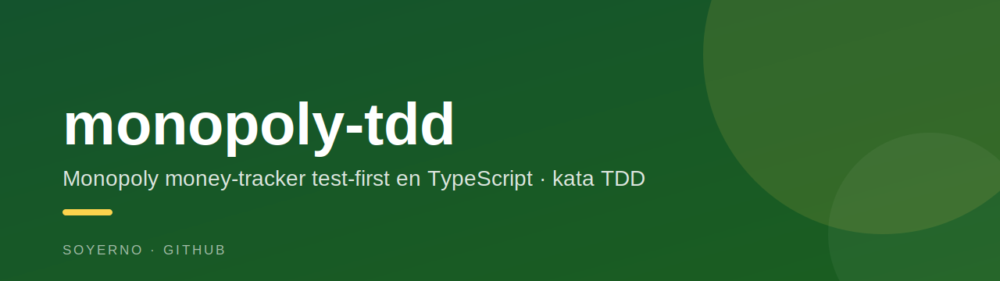

<p align="center">
  
</p>

# monopoly-tdd

A small **Monopoly money-tracker** modeled test-first in TypeScript — a kata to practice **TDD** and clean domain modeling.

It doesn't render a board; it models the part that actually matters in a real game night: **who owes whom, and how the bank's money moves**. Every behavior was written as a failing test first, then implemented.

## Domain

- **`Monopoly`** — game instance created with an `initialCash`. Starts with the **Bank** as player, exposes `addPlayer(name)`, the list of `players`, and a `history` of actions.
- **`Player`** — `name` and `cash`, with `addCash` / `removeCash`.
- **`Action`** — a money transfer `from` one player `to` another for an `amount`; `do()` applies it and it's timestamped and recorded in history.

## Stack

TypeScript · Jest (`ts-jest`) · ESLint · Husky

## Run

```bash
npm install
npm test          # run the suite
npm run test:watch
npm run build     # tsc
```

## Why it exists

A focused exercise in **red → green → refactor**: model a familiar domain from its tests outward, keeping the design minimal and driven by behavior rather than guesses.